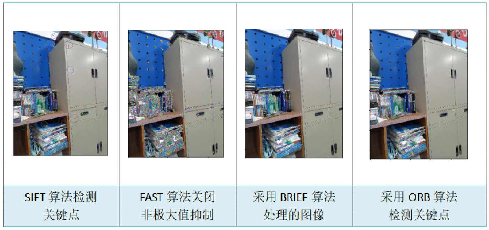
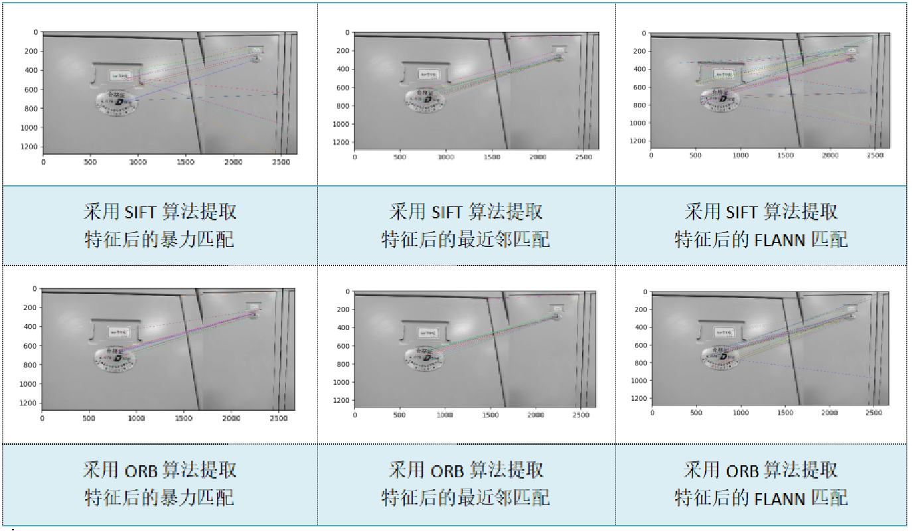
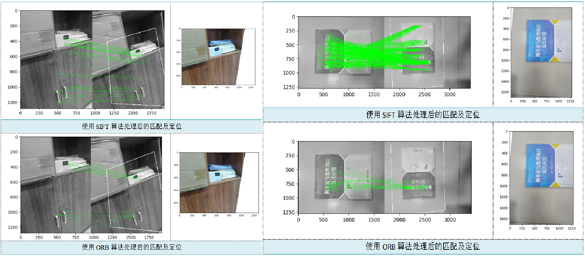
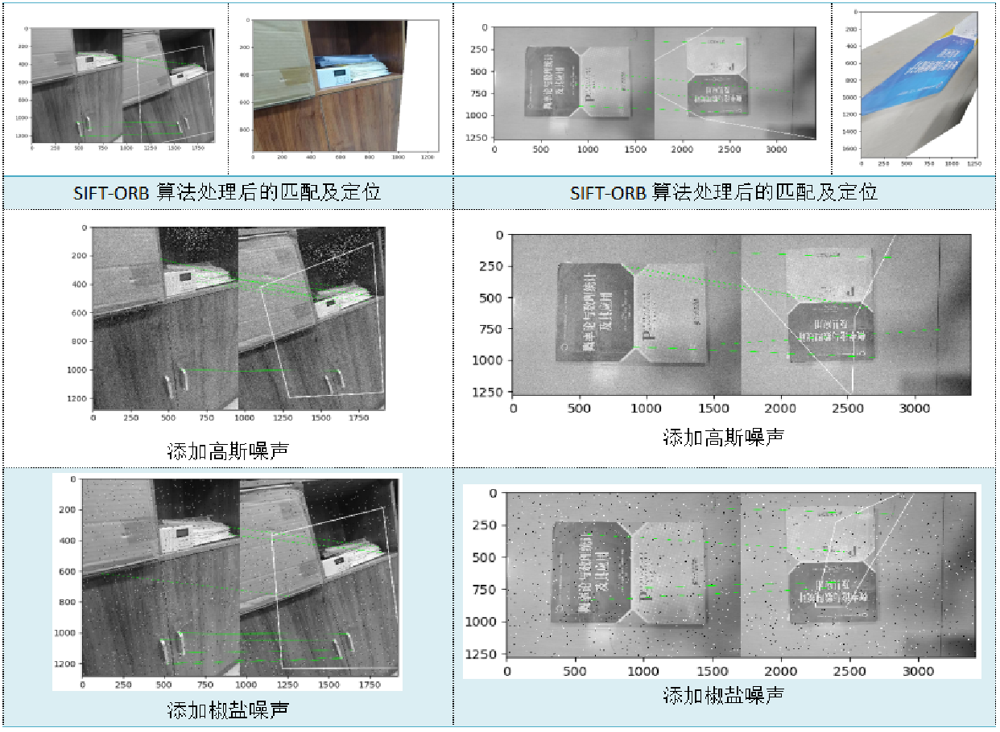

# Image-feature-extraction
对图像特征提取的常用算法进行对比，学习了几种特征匹配及定位的实现

首先用简单的示例分析了常见特征提取算法的优缺点。SIFT算法和ORB算法的效果都不错。为了深入对比，并将二者提取的关键点进行了匹配定位，从而得出：在匹配关键点的算法中，KNN匹配易于实现，但计算量仍然很大；FLANN算法计算快，但是对于小规模数据集可能会出现一些误差。因此当对时间要求较高时，采用ORB算法和FLANN进行匹配定位；在对时间要求不高的情况下,采用SIFT算法结合KNN进行匹配,可以得到比较精确的定位结果。并且单独使用两种算法进行后续两幅图的透视变换，得到的定位效果确实不错，由单应性变换得到的四边形的关键点非常接近。不考虑计算成本，SIFT的效果显然更好。

接着，思考能否实现结合这两种特征提取与计算算法的优点的算法，提出了SIFT-ORB融合算法，以便更好地比较SIFT和ORB处理后的匹配定位结果。在保证精度的同时加快计算速度，适用于实时匹配的场景。采用SIFT算法提取特征点,再利用ORB算法计算得到关键点的描述信息，进而完成目标图像的匹配与定位。然后通过添加高斯噪声、椒盐噪声进行对比分析。但是效果并不是很理想。经分析后发现，尽管SIFT-ORB算法检测到了更精确的关键点，有很好的尺度不变性和旋转不变性，提供了高效率的运算速度,内存占用也较小，但仍然有较少的匹配点，甚至连最佳关键点数目都匹配不上。经过查阅资料得知，忽略了关键的一点就是，SIFT和ORB算法之间的匹配很多时候会不如同一算法之间的匹配精确，需要更加深入两种算法的原理。可以采用RANSAC算法对初次匹配得到的结果再优化，进而获取准确的特征点对。总之，SIFT-ORB融合算法在计算机视觉领域还是有着广泛的应用价值。

**特征提取常用算法对比**

**特征匹配**

**单应性变换**

SIFT和ORB单独处理

SIFT结合ORB处理
